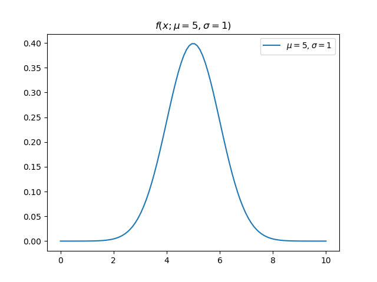
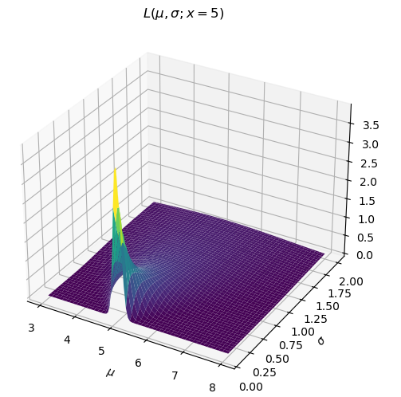

*4/25/25*

### Notes on Likelihood

Take a Gaussian probability distribution
$$
f(x; \mu, \sigma)=\frac{1}{\sigma\sqrt{2\pi}}\exp(-\frac{1}{2}(\frac{x-\mu}{\sigma})^2)
$$

This is a function of $x$ and is parameterized by $\mu$ and $\sigma$. If we instead consider the expression on the right as a function of $\mu$ and $\sigma$, parameterized by $x$, we have the likelihood function
$$
L(\mu, \sigma; x)=\frac{1}{\sigma\sqrt{2\pi}}\exp(-\frac{1}{2}(\frac{x-\mu}{\sigma})^2)
$$

This is the definition of the likelihood function.

I'll emphasize that the expression on the right hasn't changed. A few things fall out of this
1) Previously the integral of $f$ (holding $\mu$, $\sigma$ constant) over $x$ was 1. Now if we integrate $L$ over $\mu$ and $\sigma$ (holding x constant) there is no reason to expect the integral is still 1.
2) $L$ evaluated at $(\mu=a,\sigma=b;x=5)$ is a likelihood. If $f$ happened to be parameterized by $\mu=a,\sigma=b$ and evaluated at $x=5$ the result would be the same (since the expression is the same). Therefore, the value of $f$ evaluated at $x=5$ is the likelihood of its parameters parameterized by $x=5$. That's a long-winded way to say $f(x)$ is a likelihood. (Remember it is the integral of $f$ which is a probability: $\int_a^bfdx$).

So what does it mean? Look at the line on this surface for $\mu=5.5$. Notice that near $\sigma=0$ it has a low likelihood. As $\sigma$ increases, its likelihood increases for a bit and then declines again. Consider three points along that line ($\mu$, $\sigma$) = (5.5, 0.2), (5.5, 1), (5.5, 2). How did we calculate the value of $L$ at each of these points? We just plugged in these $(\mu, \sigma)$ pairs along with $x=5$ into the expression above. Let's visualize our doing that, but letting x vary again (notice these curves are PDFs now).

The value of our likelihood surface for each combination $(\mu, \sigma)$ is the intersection of the red line with each of these PDFs. Orange performs the best. Even if we centered the green PDF on $x=5$ it would still not have as high a value as the orange curve. So we can think about the values of the likelihood function like this: "how well does this pair of parameters $(\mu,\sigma)$ fit the data point $x=5$?"

That brings us to Wikipedia's definition: "A likelihood function (often simply called the likelihood) measures how well a statistical model explains observed data by calculating the probability of seeing that data under different parameter values of the model." Hopefully this is clear now.

One last thing. Wikipedia's article continues "It is constructed from the joint probability distribution of the random variable that (presumably) generated the observations". When I said earlier that the definition of the Likelihood was simply the PDF with its parameters considered as variables that was only partially true. It is actually the *joint* PDF. In this case we just considered a "joint" PDF with only one part.
$$
L(\mu, \sigma; x_1,x_2,...x_n)\triangleq \prod_{i=1}^nf(x_i;\mu,\sigma)=\prod_{i=1}^n\frac{1}{\sigma\sqrt{2\pi}}\exp(-\frac{1}{2}(\frac{x_i-\mu}{\sigma})^2)
$$
The likelihood function is useful because it helps us guess the parameters of a distribution given some samples from it. Say we have IID samples $x_1,x_2,\cdots,x_n$, from a known distribution with unknown parameters, and we want to find the parameters which maximize the probability of having drawn this sample. The parameters which maximize the likelihood function are those parameters! If this isn't clear, think back to the one dimensional case and the previous figure. 

Here is a simple example of this process (called a maximum likelihood estimate) for three data points assumed to be drawn from a Gaussian distribution

