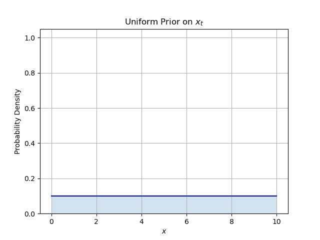

# Introduction to Particle Filters
To illustrate the particle filter, its best to start with a 1-dimensional example. Consider Tom and Jerry. Jerry is inside a wall and running back and forth. Tom is outside of the wall, and trying to locate Jerry based on the occasional scratching sounds he hears. However, the wall is a bit echo-y so the sounds Tom hears may not be exactly where Jerry is. Given these sounds he needs to estimate Jerry's position. Fortunately for Tom, he knows the following things. 

First, he knows the probabilistic patterns of Jerry's movement. Given Jerry's position at time $t$, $x_t$, he has a probability distribution of Jerry's position at time $t+1$: $x_{t+1}=f(x;x_t)$. Second, he knows how echo-y the wall is. In other words, given Jerry's position $x_t$, he knows where he is likely to hear a sound: $y_t=g(x;x_t)$. (My notation here means that $g$ is a function of a single variable: $x$, and is parameterized by $x_t$). To be clear, Tom doesn't know $x_t$, he only knows (probabilistically) where Jerry would go or where he would hear a sound *if* he could see through the wall.

Beyond these distributions, Tom has been listening and kept track of the time and location of each sound he has heard. We write this as $y_1, y_2, ... y_t = y_{1:t}$. He wants to guess Jerry's position at time $t$. This is called the filtering problem.

Before tackling the filtering problem, let's start with a simpler problem: Given a single noise at time $t$, where is Jerry? To do that, we will need to know $g(x;x_t)$. Tom knows this a priori, and he tells us it is a 1D gaussian centered at Jerry location with a standard deviation of 0.5:
$$
\begin{aligned}
&f(x; \mu, \sigma)=\frac{1}{\sigma\sqrt{2\pi}}\exp(-\frac{1}{2}(\frac{x-\mu}{\sigma})^2)\\
&f(x; x_t, 0.5)=\frac{1}{0.5\sqrt{2\pi}}\exp(-\frac{1}{2}(\frac{x-x_t}{0.5})^2)\\
\end{aligned}
$$
Here's our first problem, we don't have $x_t$ -- in fact that's what we are trying to find. Fortunately we don't need to know it, we only need a probability distribution of where we thought Jerry was before hearing the sound. This may not sound fortunate, since we knew nothing about his location before the sound! But that is ok, because we can just shrug and give an equal probability to every position. This is called a uniform prior. Uniform because the probability everywhere is the same. A "prior" is just what we call this distribution which represents our knowledge before receiving any data. Assuming the wall is 10 meters long, our uniform prior will look like this:

Now, assume we hear the noise at $x=8$. 

$$
P(x_t=x|\textrm{sound})=\frac{P(\textrm{sound}|x)}{}
$$

question
- what is $f$ called? This suggests that $f$ must be a pdf. Is that correct? Must $g$ be a pdf too? (think so)

update step
- motion model
- prior
- Likelihood
- Resampling

