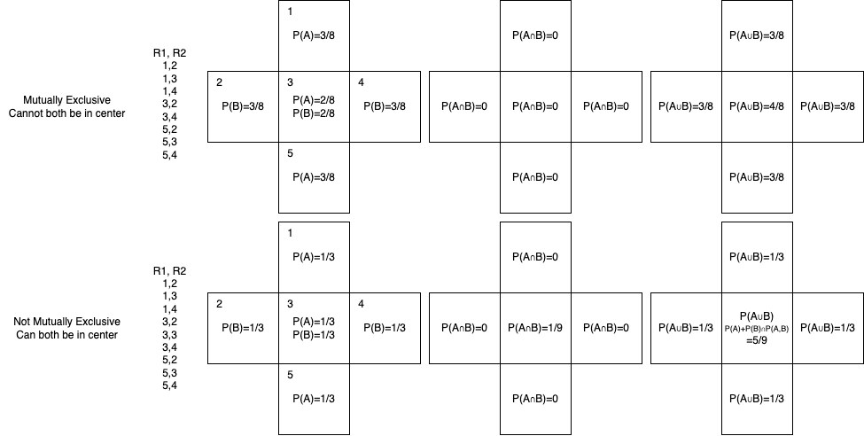

In the non-mutually exclusive case, what does the integral of $P(A\cup B)$ over the whole space represent (17/9)? Each individual cell is the probability that at least one rabbit is inside of it. So it seems strange(?) that this isn't 2. It is 2 in the top case. Of course the missing 1/9 is the overlapping scenario.

- $P(A\cap B)=P(A,B)=\textrm{"and"}$
- I don't think we can't think in terms of joint distributions since the event space is not the same, it just happens to overlap.

